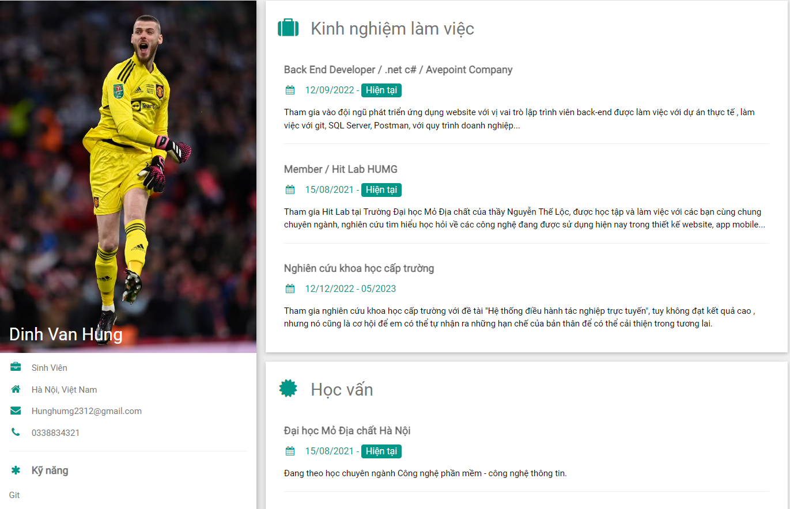

# Giới thiệu

Repo là các bài tập từ đầu của học phần thiết kế website.
Hướng dẫn bởi ######GVC.TS. Trần Trung Chuyên

## Mô tả


Trang website cá nhân lấy từ w3school template
```bash
git clone git@github.com:whysoez/web_design.git
```

